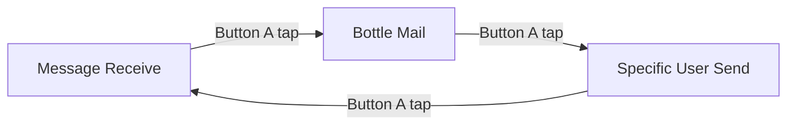

# Tracelet User Manual

**Draw traces. Send bottles. Receive messages from friends.**

Tracelet is a minimal, canvas-first messenger. You draw with your finger, and traces become messages — played back stroke-by-stroke on another person’s screen. The interface is built around two virtual hardware buttons (blue **A** and green **B**) in the bottom corners, plus a full-screen drawing canvas.

---

## At a glance

| | |
|---|---|
| **Canvas** | Black screen; your strokes appear in white (or your trace style) and gently fade |
| **Button A** (blue, bottom-left) | Change mode, toggle notifications, save name traces |
| **Button B** (green, bottom-right) | Play/receive messages, friends, destinations |
| **Both buttons** | Short press: settings or mode shortcuts · Long press: name-trace registration |
| **Account** | Works as **Guest**; sign in to sync settings and friends across devices |

---

## The screen

```
┌─────────────────────────────────────┐
│                                     │
│         Drawing canvas              │
│    (traces fade after you draw)     │
│                                     │
│                                     │
│  ┌──────────┐         ┌──────────┐  │
│  │    A     │         │    B     │  │
│  │  (blue)  │         │ (green)  │  │
│  └──────────┘         └──────────┘  │
└─────────────────────────────────────┘
```

- **Draw** anywhere on the canvas with one finger.
- **Do not use a second finger** while sending a bottle message — multi-touch cancels the send.
- Short **visual ripples** in the corners confirm button presses and mode changes.

---

## Three main modes

Tap **Button A** (short press) to cycle modes. Each mode shows a different system trace animation when you switch.



| Mode | What it’s for |
|------|----------------|
| **Message Receive** | Play traces from friends in your inbox |
| **Bottle Mail** | Send a trace into the shared “ocean” and pull a random bottle from someone else |
| **Specific User Send** | Work with a chosen friend: replay their trace, switch destination, register a name trace |

A fourth mode — **Name Trace Registration** — appears temporarily while you record a personal signature trace for a friend (see below).

---

## Button reference

Gestures use roughly **½ second** for a long press.

### Button A (blue)

| Mode | Short tap | Long press |
|------|-----------|------------|
| **Message Receive** | Next mode → Bottle Mail | Toggle **Notifications** on/off |
| **Bottle Mail** | Next mode → Specific User Send | Toggle **Notifications** on/off |
| **Specific User Send** | Next mode → Message Receive | Toggle **Notifications** on/off |
| **Name Trace Registration** | **Save** your name trace and return to Specific User Send | — |

### Button B (green)

| Mode | Short tap | Long press |
|------|-----------|------------|
| **Message Receive** | Play **next unplayed** message from inbox | Toggle **Auto-play** on/off |
| **Bottle Mail** | **Receive** a random bottle from the ocean | **Connect friend** (from last received sender) |
| **Specific User Send** | **Replay** last received message | **Switch destination** (cycle friends) |
| **Name Trace Registration** | *(ignored)* | *(ignored)* |

### Both buttons together

| Mode | Short press (both) | Long press (both) |
|------|--------------------|-------------------|
| **Message Receive** | **Remove** last sender from friends | — |
| **Bottle Mail** | Toggle **Auto-continuous receive** on/off | — |
| **Specific User Send** | Open **Settings** | Start **Name Trace Registration** |
| **Name Trace Registration** | Open **Settings** | — |

---

## Mode guide

### Message Receive

Your inbox of traces from people you know.

1. Switch to **Message Receive** (Button A until the mode trace plays).
2. Tap **Button B** to play the next message you haven’t watched yet.
3. The trace redraws itself on your canvas; haptics play during playback.

**Tips**

- If nothing plays, you’ve seen all messages — Tracelet shows a “no message” feedback trace.
- **Long-press B** to turn **Auto-play** on: new messages can chain automatically (status shown in Settings).
- **Both buttons, short press** removes the sender of your last received message from your friends list.

---

### Bottle Mail

Send an anonymous trace into a shared pool and receive someone else’s.

#### Sending a bottle

1. Switch to **Bottle Mail**.
2. Draw your trace on the canvas with **one finger**.
3. **Lift your finger** and hold still for about **1.5 seconds** — the app sends automatically.
4. A success trace confirms the bottle was deposited.

**Important**

- **Empty strokes are not sent.**
- If you touch the screen with **two fingers**, the pending send is **cancelled** and the drawing is discarded after the idle timer.
- If you keep drawing, the 1.5 s timer resets — finish your stroke, then pause to send.

#### Receiving a bottle

1. In **Bottle Mail**, tap **Button B** (short).
2. Tracelet pulls the next available bottle from the ocean and plays it.
3. You **won’t receive your own bottle** on the same device — it stays in the ocean for others.

**Limits**

| Plan | Random receives per day |
|------|-------------------------|
| Free | 10 |
| Subscribed | 100 |

When you hit the limit, receive attempts show “no message” feedback until the next day.

**Friends**

- After you receive a bottle, **long-press B** to send a friend request to that sender and accept them in one step.
- **Both buttons, short press** toggles **Auto-continuous receive** (keep pulling bottles when available).

---

### Specific User Send

Focus on one friend at a time.

| Action | How |
|--------|-----|
| Replay their last trace | Short tap **B** |
| Cycle to another friend | Long press **B** (if they have a saved name trace, it plays; otherwise you see a destination-selected cue) |
| Open Settings | Both buttons, short press |

#### Name Trace Registration

Record how *you* draw a friend’s name or symbol so you can recognize them quickly.

1. Be in **Specific User Send**.
2. **Press and hold both buttons** (~½ s).
3. Draw your name trace on the canvas (one continuous gesture works best).
4. Short tap **Button A** to **save**, or switch away to cancel without saving.

After saving, you return to Specific User Send automatically.

---

## Drawing & trace styles

While you draw (outside of message playback), strokes **fade away** after about a second — the canvas stays clean. Playback messages use the sender’s original timing and style.

Choose how *your* traces look when you send them:

1. Open **Settings** (both buttons, short press — from Bottle Mail or Specific User Send; or navigate from Message Receive via mode change first).
2. Under **Trace style**, pick a preset:

| Preset | Character |
|--------|-----------|
| **Pure Finger** | Raw finger input, minimal processing |
| **A Little Prettify** | Light smoothing + subtle sparkle *(default)* |
| **Prettified** | Strong smoothing + glow particles |

These affect bottles you send and how your line feels while drawing.

---

## Settings & account

Open **Settings** from the simultaneous short press (see above), or use the in-app list.

| Setting | How to change |
|---------|----------------|
| **Mute** | Toggle in Settings — disables haptic feedback |
| **Trace style** | Radio buttons in Settings |
| **Notifications** | Button A long press *(status shown in Settings)* |
| **Auto-play** | Button B long press in Message Receive *(status in Settings)* |
| **Auto-continuous** | Both buttons short press in Bottle Mail |
| **Account** | Settings → Account |

### Guest vs signed in

- **Guest** — Tracelet works immediately with a device-local identity. Bottles and inbox work; settings stay on this device.
- **Signed in** (Google / Apple when configured) — friends and settings can follow you across devices.

From **Settings → Account** you can sign in or return to guest mode.

*Profile QR and Billing appear in Settings but are not yet active in this build.*

---

## Feedback you’ll see & feel

Tracelet communicates through **haptics**, **corner glows**, and **brief system traces** (animated line art on the canvas).

| Feedback | Meaning |
|----------|---------|
| Blue ripples (left) | Mode change, notifications toggle |
| Green ripples (right) | Message actions, auto-play, bottle actions |
| “No message” trace | Inbox empty, ocean empty, or daily limit reached |
| Bottle sent trace | Your bottle was deposited |
| Bottle error trace | Send or receive failed (network/auth) |
| X / alert trace | Action not available (no sender, no destination, empty name trace) |

If haptics feel too strong, enable **Mute** in Settings.

---

## Quick troubleshooting

| Problem | Try this |
|---------|----------|
| Bottle won’t send | Draw at least one visible stroke; wait 1.5 s without touching; use only one finger |
| Send was cancelled | Second finger touched the screen — draw again |
| Can’t receive my own bottle | Expected — receive on another device or ask a friend to pull it |
| No message on receive | Inbox/ocean empty, or daily bottle limit reached |
| Settings won’t open | Use **both buttons, short press** in Bottle Mail or Specific User Send |
| Name trace won’t save | Draw something visible, then short tap **A** (not B) |
| Sign-in buttons disabled | Social login not configured for this build — continue as Guest |

---

## Summary cheat sheet

```
Button A tap     →  cycle mode (Receive → Bottle → Specific → …)
Button A long    →  notifications on/off

Button B tap     →  Receive: play next · Bottle: receive · Specific: replay
Button B long    →  Receive: auto-play · Bottle: add friend · Specific: next friend

Both tap         →  Receive: remove sender · Bottle: auto-continuous · Specific: settings
Both long        →  Specific User Send only → name trace registration
```

---

*Tracelet — say it with a line.*
